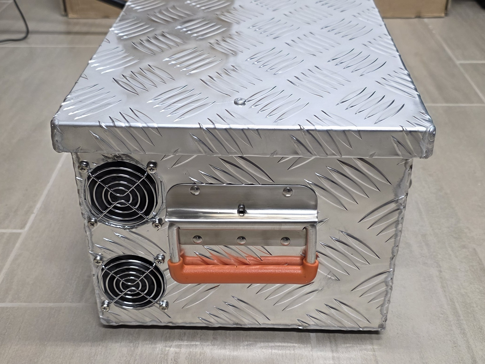

<div align="center">

# ⚡ Home Solar Portable Emergency Charger

### Notstrom-Ladegerät für PV-Heimspeicher mittels Generator
### Emergency Charger for PV Home Battery Systems using Generator

[](https://creativecommons.org/licenses/by-nc-sa/4.0/)
[](#)
[](#)



**[🇩🇪 Deutsch](#-deutsch)** | **[🇬🇧 English](#-english)**

</div>

---

## 📋 Table of Contents / Inhaltsverzeichnis

- [🇩🇪 Deutsch](#-deutsch)
  - [Überblick](#überblick)
  - [Das Problem](#das-problem)
  - [Die Lösung](#die-lösung)
  - [Hauptkomponenten](#-hauptkomponenten)
  - [Dokumentation](#-dokumentation)
- [🇬🇧 English](#-english)
  - [Overview](#overview)
  - [The Problem](#the-problem)
  - [The Solution](#the-solution)
  - [Main Components](#-main-components)
  - [Documentation](#-documentation)
- [⚠️ Safety / Sicherheit](#%EF%B8%8F-safety--sicherheit)
- [📚 References / Referenzen](#-references--referenzen)
- [📄 License / Lizenz](#-license--lizenz)

---

## 🇩🇪 Deutsch

### Überblick

Dieses Open-Source-Projekt beschreibt den Bau eines **portablen Notstrom-Ladegeräts** für PV-Heimspeicher-Systeme (E3/DC, Fronius, SMA, etc.). Das System ermöglicht es, einen handelsüblichen Generator zur Ladung des Hausspeichers zu nutzen, wenn das Stromnetz ausfällt.

### Das Problem

Viele moderne Heimspeicher-Systeme (wie E3/DC) verweigern das direkte Laden der Batterie über einen Generator am AC-Eingang aufgrund von:
- 🔴 Frequenzinstabilitäten des Generators
- 🔴 Netzqualität entspricht nicht den Anforderungen
- 🔴 Fehlende Grid-Code-Konformität

### Die Lösung

Statt den Generator direkt ans Hausnetz anzuschließen, nutzen wir einen **alternativen Ansatz**:

```
Generator (230V AC) 
    ↓
MeanWell CSP-3000-400 Netzteil
    ↓
DC-Spannung (350-400V, bis 7.5A)
    ↓
Sperrdioden (Anti-Backfeed)
    ↓
PV-Eingang (MPPT) des Wechselrichters
    ↓
Batterie wird geladen ✅
```

Das System **simuliert eine Solaranlage** und speist DC-Strom direkt in die MPPT-Tracker ein, wodurch der Heimspeicher geladen wird!

### 🔧 Hauptkomponenten

| Komponente | Spezifikation | Preis (ca.) |
|------------|---------------|-------------|
| **MeanWell CSP-3000-400** | 400V DC, 7.5A, 3000W Schaltnetzteil | 350€ |
| **Generator** | Min. 3kW (höher empfohlen) | variabel |
| **Sperrdioden** | 1000V, 30A (parallel geschaltet) | 10€ |
| **DC-Lasttrennschalter** | Hager SB432PV oder ähnlich | 50€ |
| **MC4-Stecker/Buchsen** | Standard PV-Anschlüsse | 5€ |
| **3D-gedrucktes Gehäuse** | STL-Dateien inkludiert | Materialkosten |

**Gesamtkosten**: ca. **450-550€** (ohne Generator)

### 📖 Dokumentation

| Dokument | Beschreibung |
|----------|--------------|
| **[📦 Stückliste (PARTS.md)](documentation/PARTS.md)** | Vollständige Komponentenliste mit Amazon-Links |
| **[🔨 Aufbauanleitung (ASSEMBLY.md)](documentation/ASSEMBLY.md)** | Schritt-für-Schritt Montageanleitung mit Fotos |
| **[⚡ Schaltplan (SCHEMATICS.md)](documentation/SCHEMATICS.md)** | Detaillierte Verdrahtung und Anschlussdiagramme |
| **[🖨️ 3D-Druck Dateien](documentation/3d_files/)** | STL-Dateien für Gehäuse und Halterungen |

---

## 🇬🇧 English

### Overview

This open-source project describes the construction of a **portable emergency charger** for PV home battery systems (E3/DC, Fronius, SMA, etc.). The system enables the use of a standard generator to charge your home battery when the grid fails.

### The Problem

Many modern home battery systems (like E3/DC) refuse to charge directly from a generator via the AC input due to:
- 🔴 Generator frequency instability
- 🔴 Grid quality doesn't meet requirements
- 🔴 Missing grid code compliance

### The Solution

Instead of connecting the generator directly to the home grid, we use an **alternative approach**:

```
Generator (230V AC) 
    ↓
MeanWell CSP-3000-400 Power Supply
    ↓
DC Voltage (350-400V, up to 7.5A)
    ↓
Blocking Diodes (Anti-Backfeed)
    ↓
PV Input (MPPT) of Inverter
    ↓
Battery Charging ✅
```

The system **simulates a solar array** and feeds DC power directly into the MPPT trackers, allowing the home battery to charge!

### 🔧 Main Components

| Component | Specification | Price (approx.) |
|-----------|---------------|-----------------|
| **MeanWell CSP-3000-400** | 400V DC, 7.5A, 3000W Power Supply | 350€ |
| **Generator** | Min. 3kW (higher recommended) | varies |
| **Blocking Diodes** | 1000V, 30A (paralleled) | 10€ |
| **DC Disconnect Switch** | Hager SB432PV or similar | 50€ |
| **MC4 Connectors** | Standard PV connectors | 5€ |
| **3D-printed Housing** | STL files included | Material costs |

**Total Cost**: approx. **450-550€** (excluding generator)

### 📖 Documentation

| Document | Description |
|----------|-------------|
| **[📦 Parts List (PARTS.md)](documentation/PARTS.md)** | Complete component list with Amazon links |
| **[🔨 Assembly Guide (ASSEMBLY.md)](documentation/ASSEMBLY.md)** | Step-by-step assembly instructions with photos |
| **[⚡ Schematics (SCHEMATICS.md)](documentation/SCHEMATICS.md)** | Detailed wiring and connection diagrams |
| **[🖨️ 3D Print Files](documentation/3d_files/)** | STL files for housing and mounts |

---

## ⚠️ Safety / Sicherheit

<div align="center">

### ⚡ HOCHSPANNUNG - LEBENSGEFAHR / HIGH VOLTAGE - DANGER ⚡

</div>

**🇩🇪 Deutsch:**
- ⚠️ Dieses Projekt arbeitet mit **bis zu 400V DC** - tödliche Spannung!
- ⚠️ Arbeiten an Hochspannungssystemen nur durch **Elektrofachkräfte**
- ⚠️ Niemals unter Last stecken/trennen (Lichtbogengefahr!)
- ⚠️ Generator nur im **Außenbereich** betreiben (Abgasgefahr!)
- ⚠️ Verpolung zerstört sofort die Anlage
- ⚠️ Alle Schaltungen **doppelt prüfen** vor Inbetriebnahme

**🇬🇧 English:**
- ⚠️ This project involves **up to 400V DC** - lethal voltage!
- ⚠️ High voltage work only by **qualified electricians**
- ⚠️ Never connect/disconnect under load (arc flash hazard!)
- ⚠️ Generator operation **outdoors only** (exhaust hazard!)
- ⚠️ Reverse polarity will instantly destroy equipment
- ⚠️ **Double-check** all connections before operation

<div align="center">

**⚡ Nachbau auf eigene Gefahr! / Build at your own risk! ⚡**

</div>

---

## 📚 References / Referenzen

**🇩🇪 Ursprungsquelle / 🇬🇧 Original Source:**

Dieses Projekt basiert auf den Community-Diskussionen im Photovoltaikforum und der Zusammenfassung "Notstrom Zusammenfassung V3.pdf" von Mitgliedern des Forums.

This project is based on community discussions in the Photovoltaikforum and the summary "Notstrom Zusammenfassung V3.pdf" by forum members.

- 📖 **Forum Thread**: [Notstrom über Generator bei EFH mit E3/DC und Wärmepumpe](https://www.photovoltaikforum.com/thread/163745-notstrom-%C3%BCber-generator-bei-efh-mit-e3-dc-und-w%C3%A4rmepumpe/?pageNo=1)
- 📄 **Original PDF**: [Notstrom Zusammenfassung V3.pdf](https://www.photovoltaikforum.com/thread/163745-notstrom-%C3%BCber-generator-bei-efh-mit-e3-dc-und-w%C3%A4rmepumpe/?postID=2635713#post2635713) - Download im Forum verfügbar / Download available in forum
- 👥 **Credits**: Arno Waldmann, Roland B., und alle Forumsteilnehmer / and all forum participants

---

## 📄 License / Lizenz

<div align="center">

[![CC BY-NC-SA 4.0][cc-by-nc-sa-shield]][cc-by-nc-sa]

Dieses Werk ist lizenziert unter einer [Creative Commons Attribution-NonCommercial-ShareAlike 4.0 International License][cc-by-nc-sa].

This work is licensed under a [Creative Commons Attribution-NonCommercial-ShareAlike 4.0 International License][cc-by-nc-sa].

[cc-by-nc-sa]: http://creativecommons.org/licenses/by-nc-sa/4.0/
[cc-by-nc-sa-shield]: https://img.shields.io/badge/License-CC%20BY--NC--SA%204.0-lightgrey.svg

**Das bedeutet / This means:**
- ✅ Teilen / Share — copy and redistribute
- ✅ Anpassen / Adapt — remix, transform, build upon
- ⚠️ Namensnennung / Attribution required
- ⚠️ Weitergabe unter gleichen Bedingungen / ShareAlike
- 🚫 **KEINE kommerzielle Nutzung / NO commercial use**

</div>

---

<div align="center">

### 🌟 Wenn dir dieses Projekt gefällt, gib ihm einen Star! / If you like this project, give it a star! 🌟

**Made with ❤️ by the DIY Solar Community**

</div>
