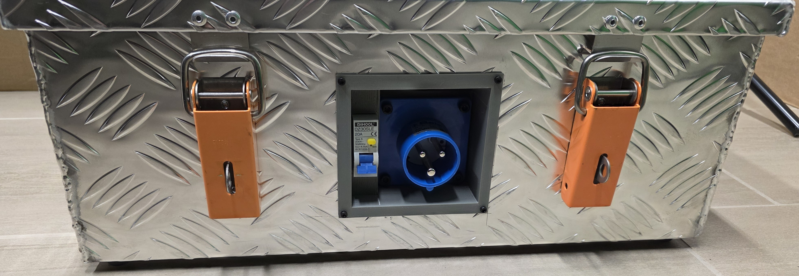
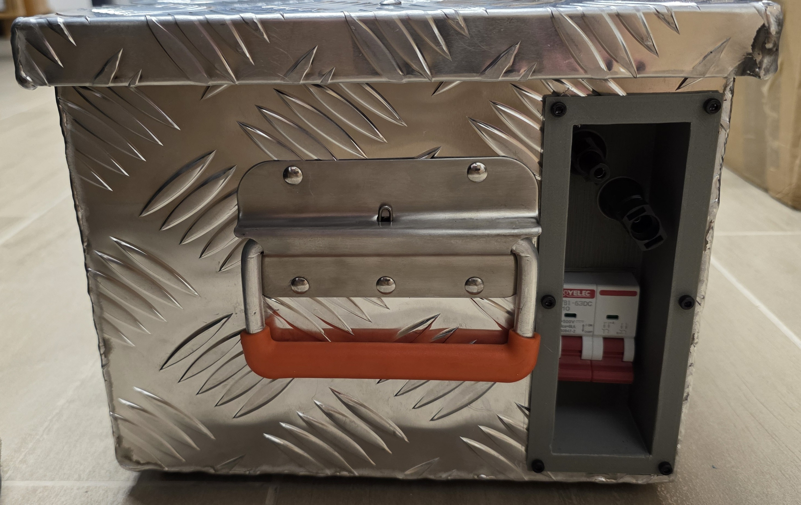
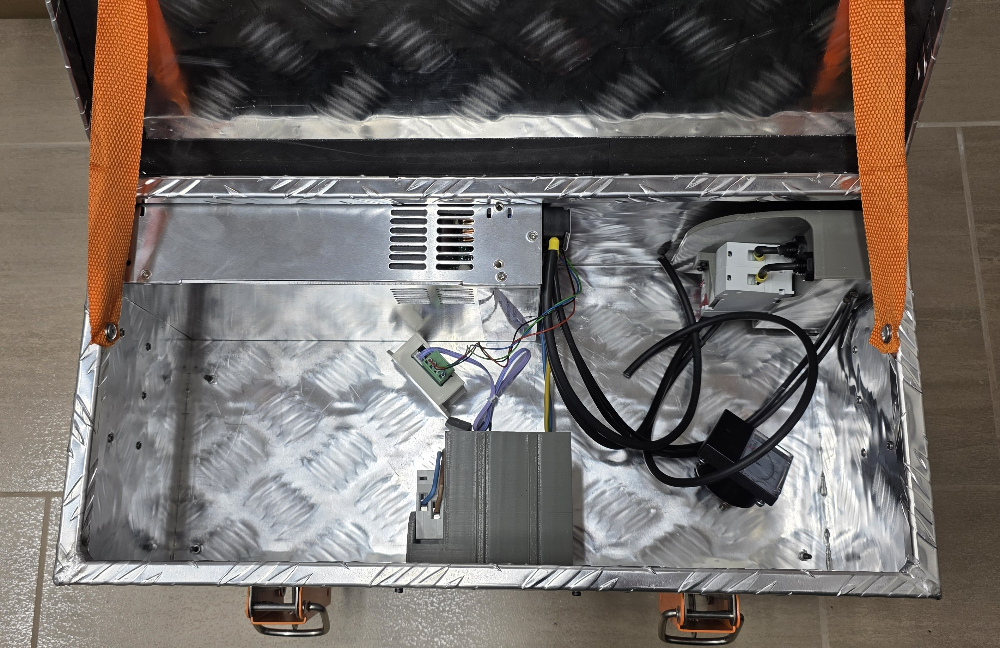
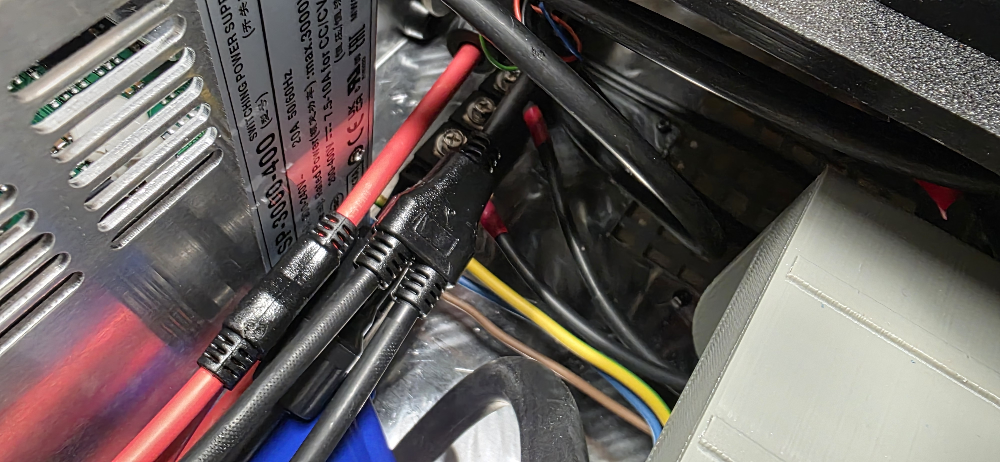
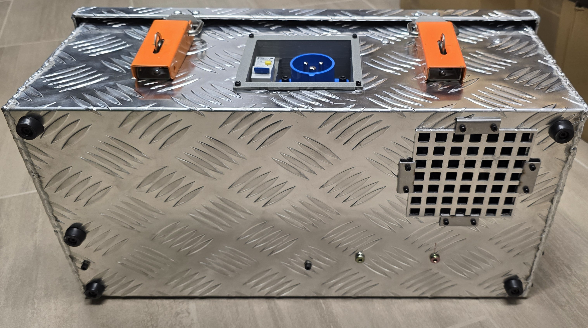

# Aufbauanleitung / Assembly Instructions

## Gehäuse & Montage / Housing & Mounting

Das Projekt verwendet 3D-gedruckte Teile für die Montage der Anschlüsse. Die STL-Dateien befinden sich im Hauptverzeichnis.
The project uses 3D printed parts for mounting the connectors. The STL files are located in the main directory.

### Benötigte Teile / Required Parts
*   **3D Prints**:
    *   [`DIN_RAIL_Mount_lying.stl`](3d_files/DIN_RAIL_Mount_lying.stl): Halterung für das MeanWell Netzteil (auf Hutschiene oder verschraubt).
    *   [`Solar-Box-CEE-Stecker_v3.stl`](3d_files/Solar-Box-CEE-Stecker_v3.stl): Halterung für den CEE-Eingangsstecker.
    *   [`Solar-Box-Solar.Stecker_V2.stl`](3d_files/Solar-Box-Solar.Stecker_V2.stl): Halterung für die MC4-Ausgangsbuchsen.
    *   [`Deckplatte_Solar-charge.stl`](3d_files/Deckplatte_Solar-charge.stl): Abdeckung.
*   **Gehäuse / Box**: Eine geeignete Industrie-Box oder Eurobox, in die alles passt (siehe Galerie unten).
*   **Kabel / Cables**: Ausreichender Querschnitt fürAC (1.5mm²+) und DC (4-6mm² Solarkabel).

### Schritt-für-Schritt / Step-by-Step

1.  **Drucken der Teile** / Print the parts using PETG or ABS for heat resistance.
2.  **Montage Netzteil** / Mount the MeanWell CSP-3000-400 securely in the box using the `DIN_RAIL_Mount` or screws. Ensure good airflow (active cooling fan of PSU needs space).
3.  **AC-Anschluss** / Install the CEE plug mount. Connect the AC input cable to the protection fuse (if used) and then to the PSU AC terminals.
4.  **DC-Anschluss** / Install the MC4 mounts. Connect the internal DC cables from the PSU output to the MC4 sockets.
    *   **WICHTIG/IMPORTANT**: Integrieren Sie die Sperrdioden (Blocking Diodes) in die Zuleitung zu den MC4-Buchsen (Plus-Pol)!
5.  **Steuerleitungen** / Connect the control wires (Ribbon cable) if using external control for voltage/current adjustment provided by the kit. Use the `Kabelkit SYNCKABEL`.
6.  **Testen** / Close the box, ensure no exposed wires. Test voltage output with a multimeter BEFORE connecting to any system.

## Testablauf: Simulierter Blackout / Test Procedure: Simulated Blackout
(Basierend auf PDF Seite 15)

1.  Alle Hauptsicherungen ausschalten (Trennung vom Netz).
2.  Warten bis das Hauskraftwerk (z.B. E3/DC) in den Notstrombetrieb wechselt (ca. 5-10 Sek).
3.  Prüfen, ob das Haus aus der Batterie versorgt wird.
4.  Generator starten und warmlaufen lassen (Außenbereich!).
5.  MeanWell Netzteil einschalten (Start im "Constant Current" / CC Modus, ca. 400V).
6.  **WICHTIG**: Freien DC-Eingang am E3/DC wählen. Bestehende PV-Strings sicher trennen (DC Breaker) oder separaten Eingang nutzen.
7.  Verbindung herstellen (DC Breaker einschalten).
8.  Am Display beobachten: Nach ca. 1 Minute sollte die Einspeisung beginnen (z.B. 2kW).
9.  Monitor voltage and current. Ensure Battery is charging.

## Sicherheit / Safety (SAFETY.md content included)

*   **Hochspannung / High Voltage**: DC 400V ist tödlich. Nie unter Last stecken/ziehen (Lichtbogengefahr!).
*   **Verpolung / Polarity**: Falsche Polung zerstört sofort den Wechselrichter oder das Netzteil. Doppelt prüfen!
*   **Wärme / Heat**: Das Netzteil erzeugt Wärme (3000W -> ~150-300W Verlustleistung). Lüftungsschlitze nicht verdecken.
*   **Generator**: Nur im Außenbereich betreiben! Abgase sind giftig.

## Galerie / Gallery

Hier finden Sie Fotos vom Aufbau und der fertigen Box.
Here are photos of the assembly and the finished box.

