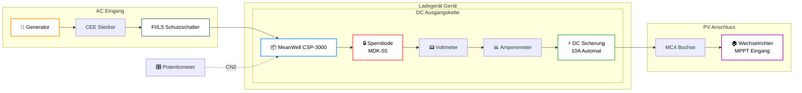

# ⚡ Schaltplan & Anschlüsse / Schematics & Connections

**Detaillierte Verdrahtung und elektrische Anschlüsse**  
**Detailed Wiring and Electrical Connections**

---

## 📊 Systemübersicht / System Overview

### Blockschaltbild / Block Diagram

---

## ⚡ Vollständiger Schaltplan / Detailed Wiring

### Reihenfolge der DC-Komponenten (Plus-Pol)

1. **MeanWell CSP-3000-400 (+V)**
2. **Sperrdiode (MDK-55)** - Verhindert Rückstrom vom PV-System.
3. **Voltmeter** - Anzeige der aktuellen Ausgangsspannung.
4. **Amperemeter** - Anzeige des Ladestroms (bis 7.5A).
5. **DC Sicherung (10A)** - Schutz vor Überlast/Kurzschluss.
6. **MC4 Ausgangsbuchse (+)**

*Der Minus-Pol (-V) wird direkt vom Netzteil zur MC4-Buchse (-) geführt.*

---

## 🎛️ Steuerung (CN2 Port)

Die Steuerung erfolgt über ein **0-10V Potentiometer-Modul**, welches an den CN2 Port des MeanWell Netzteils angeschlossen wird.

### MeanWell CN2 Pinbelegung

Bitte beachten Sie das offizielle Handbuch für die exakte Pinbelegung. Hier ist die schematische Darstellung für das Potentiometer:

- **Pin 8 (+12V AUX)**: Stromversorgung für das Potentiometer-Modul.
- **Pin 6 (V_ADJ)**: Ausgang des Potentiometers (Steuerspannung 0-10V).
- **Pin 1-5 (GND)**: Gemeinsame Masse.

> 📷 
https://www.meanwell.com/Upload/PDF/CSP-3000/CSP-3000-SPEC.PDF
> 

---

## ⚠️ Sicherheitshinweise

- **Sperrdiode**: Die Diode muss als erstes Bauteil nach dem Netzteil sitzen! Sie schützt das Netzteil vor den Spannungen der Solarpanele.
- **Sicherung**: Der 10A DC-Automat dient als Lasttrennschalter und Absicherung.
- **Analoge Anzeige**: Voltmeter und Amperemeter sind im Deckel der Alubox montiert für eine direkte Kontrolle ohne Zusatzgeräte.

---

**[◀ Zurück zur Aufbauanleitung](ASSEMBLY.md)** | **[Zurück zur Hauptseite](../README.md)**
