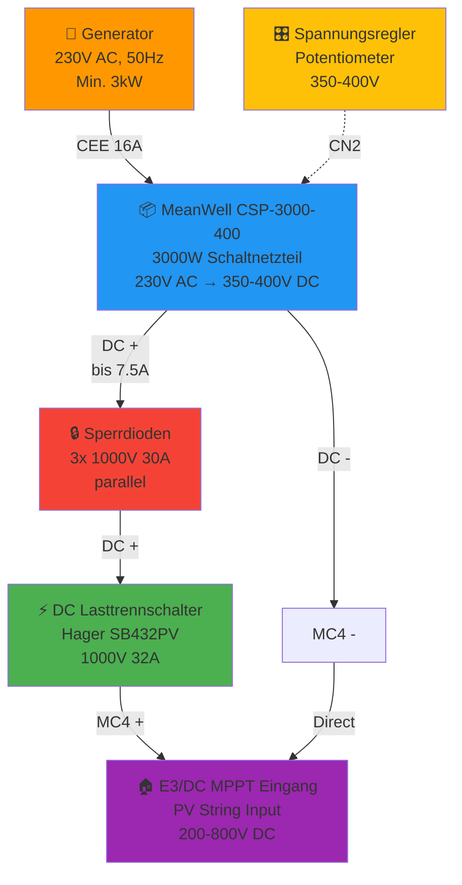

# ⚡ Schaltplan & Anschlüsse / Schematics & Connections

<div align="center">

**Detaillierte Verdrahtung und elektrische Anschlüsse**  
**Detailed Wiring and Electrical Connections**

</div>

---

## 📊 Systemübersicht / System Overview

### Blockschaltbild / Block Diagram



---

## 🔌 AC-Seite: Generator → Netzteil

### Verbindungsschema

```
┌─────────────────┐              ┌──────────────────────┐
│   Generator     │              │  MeanWell CSP-3000   │
│   230V AC       │              │                      │
│                 │   CEE-Kabel  │                      │
│  L ●────────────┼──────────────┼─→ AC/L (Terminal 1) │
│  N ●────────────┼──────────────┼─→ AC/N (Terminal 2) │
│  PE ●───────────┼──────────────┼─→ FG (Frame Ground) │
│                 │   3x1.5mm²   │                      │
└─────────────────┘              └──────────────────────┘
```

### Technische Spezifikation

| Parameter | Wert | Hinweis |
|-----------|------|---------|
| **Spannung** | 230V AC ±10% | Generatorqualität prüfen |
| **Frequenz** | 50Hz ±5% | Moderne Inverter-Generatoren besser |
| **Min. Leistung** | 3kW | 4-5kW empfohlen für Reserve |
| **Kabelquerschnitt** | 1.5mm² | Besser: 2.5mm² bei langen Wegen |
| **Absicherung** | 16A Typ B | LS-Schalter im Generator |

### Farbcodierung (Europa)

- 🟤 **Braun (L)** = Phase / Live
- 🔵 **Blau (N)** = Neutral
- 🟢🟡 **Gelb-Grün (PE)** = Schutzleiter / Earth

---

## 🔋 DC-Seite: Netzteil → PV-Eingang

### Vollständiger Schaltplan

```
                                    ┌─────────────────┐
                                    │  MeanWell       │
                                    │  CSP-3000-400   │
                                    │                 │
                                    │  +V ●           │
                                    └────┬────────────┘
                                         │ 6mm² rot
                                         │
                         ┌───────┬───────┴───────┬────────┐
                         │       │               │        │
                      ┌──┴──┐ ┌──┴──┐         ┌──┴──┐     │
                      │  D1 │ │  D2 │         │  D3 │     │ Sperrdioden
                      │ →|  │ │ →|  │         │ →|  │     │ 1000V 30A
                      └──┬──┘ └──┬──┘         └──┬──┘     │ parallel
                         │       │               │        │
                         └───────┼───────────────┴────────┘
                                 │ 6mm² rot
                                 │
                            ┌────┴────┐
                            │  DC     │
                            │  Trenn- │  Hager SB432PV
                            │  schal- │  1000V DC, 32A
                            │  ter    │
                            └────┬────┘
                                 │ 6mm² rot
                                 │
                            ┌────┴────┐
                            │  MC4    │
                            │  PLUS   │───────┐
                            │  Buchse │       │
                            └─────────┘       │
                                              │ zu PV-Eingang
┌─────────────────┐                           │ am Wechselrichter
│  MeanWell       │                           │
│  CSP-3000-400   │                           │
│                 │                           │
│  -V ●           │                           │
└────┬────────────┘                           │
     │ 6mm² schwarz                           │
     │                                        │
     │                                        │
┌────┴────┐                                   │
│  MC4    │                                   │
│  MINUS  │───────────────────────────────────┘
│  Buchse │
└─────────┘
```

### Technische Spezifikation

| Parameter | Wert | Hinweis |
|-----------|------|---------|
| **Ausgangsspannung** | 350-400V DC | Einstellbar am Netzteil |
| **Max. Strom** | 7.5A | Bei 400V = 3000W |
| **Kabelquerschnitt** | 6mm² | Standard PV-Kabel |
| **Sperrdioden** | 3x parallel | Typ: Schottky oder Standard 1000V 30A |
| **Spannungsabfall** | ~0.7-1.0V pro Diode | Bei 7.5A |

---

## 🔒 Sperrdioden-Schaltung / Blocking Diode Circuit

### Warum Sperrdioden? / Why Blocking Diodes?

**Problem ohne Dioden:**
- PV-Module können höhere Spannung haben als Netzteil
- Rückstrom fließt vom PV-System ins Netzteil
- Netzteil kann beschädigt werden
- Bei parallelem Betrieb: Kurzschluss-Gefahr!

**Lösung mit Dioden:**
- ✅ Strom fließt nur in eine Richtung (Netzteil → Wechselrichter)
- ✅ Schutz vor Rückspeisung
- ✅ Parallelbetrieb mit PV möglich (mit Vorsicht)

### Parallelschaltung der Dioden

```
     7.5A total
        ↓
    ┌───┴───┐
    │       │
   2.5A   2.5A   2.5A  ← Stromaufteilung
    │       │      │
   →|D1    →|D2   →|D3   ← Dioden
    │       │      │
    └───┬───┘      │
        └──────────┘
            ↓
        7.5A total
```

**Vorteile:**
- Geringerer Spannungsabfall
- Weniger Wärme pro Diode
- Höhere Zuverlässigkeit

### Spezifikation der Dioden

| Parameter | Min. Wert | Empfohlen |
|-----------|-----------|-----------|
| **Sperrspannung** | 800V | 1000V |
| **Durchlassstrom** | 10A | 30A |
| **Spannungsabfall** | max. 1.2V | 0.7-1.0V (Schottky) |
| **Gehäusetyp** | TO-220 | TO-247 (bessere Kühlung) |

**Produktbeispiele:**
- Schottky: STPS30H100C (30A, 100V) - NUR wenn in Reihe!
- Standard: MBR30100CT oder ähnlich
- Alternative: Amazon ASIN B0DXKYR1FZ (siehe Stückliste)

---

## 🎛️ Steuerung & Regelung / Control & Regulation

### MeanWell CN2 Port Anschluss

```
CN2 Connector (8-Pin)
┌─────────────────────────┐
│ 1  2  3  4  5  6  7  8  │
└─┬──┬──┬──┬──┬──┬──┬──┬──┘
  │  │  │  │  │  │  │  │
  │  │  │  └──┴──┴──┴──┴──── GND / Common
  │  │  └──────────────────── V_ADJ (0-5V = Spannungsregelung)
  │  └─────────────────────── I_ADJ (0-5V = Stromregelung)
  └────────────────────────── +12V OUT (max. 20mA)
```

### Option A: Fertig-Kabelkit

**Teil:** [8-pol SYNCKABEL für MeanWell](https://www.henri.de/Stromversorgung/Schaltnetzteile/Kabelsaetze/8748/Kabelkit-SYNCKABEL-8pol-Steuerleitung-fuer-MeanWell-CN1-CN2-CN100-8pol-Stecker-zur-Netzteile-Serie.html)

Einfache Plug-and-Play Lösung mit externem Potentiometer.

### Option B: Eigenbau

**Komponenten:**
- DC/DC Wandler: 12V → 10V (z.B. DEBO DCDC UP 3)
- Potentiometer: 10K linear
- Widerstände für Spannungsteiler

**Schaltplan:**

```
+12V (CN2 Pin 8) ──→ DC/DC 12V→10V ──┬───→ Poti (10K) ──→ V_ADJ (Pin 6)
                                      │
GND (CN2 Pin 1-5) ────────────────────┴────────────────→ GND
```

**Spannungsbereich:**
- 0V an V_ADJ = Min. Spannung (ca. 200V)
- 5V an V_ADJ = Max. Spannung (ca. 400V)
- Empfohlen für MPPT: 3.75V = 350V DC

---

## 🏠 Anschluss an verschiedene Wechselrichter-Systeme

### E3/DC S10/S10E

**MPPT-Eingänge:** 2 Stück (je nach Modell)

| Eingang | MPP-Bereich | Max. Spannung | Max. Strom |
|---------|-------------|---------------|------------|
| String 1 | 150-800V | 1000V | 15A |
| String 2 | 150-800V | 1000V | 15A |

**Empfehlung:**
- Charger an **freien String-Eingang**
- Spannung einstellen: **350-380V**
- Bei belegten Strings: Umschaltung via DC-Switch

### Fronius Symo/Primo

**MPPT-Eingänge:** 1-2 Stück

| Parameter | Wert |
|-----------|------|
| MPP-Spannung | 80-800V |
| Max. Eingangsstrom | 11-18A (modellabhängig) |

**Hinweis:** Laden über MPPT funktioniert NICHT bei allen Fronius-Modellen! Vorab testen.

### SMA Sunny Tripower / Boy

**MPPT-Eingänge:** 2 Stück (A+B)

| Parameter | Input A | Input B |
|-----------|---------|---------|
| MPP-Spannung | 175-800V | 175-800V |
| Max. Strom | 11A | 11A |

**Empfehlung:** Charger an Input B, normale PV an Input A.

---

## 🔧 Einstellungen am MeanWell Netzteil

### Tast-Schalter / Push Buttons

Das CSP-3000-400 hat 3 Taster:

- **SET** - Einstellungen aufrufen
- **▲** - Wert erhöhen
- **▼** - Wert verringern

### Einstellprozedur

1. **SET** 3 Sekunden drücken → Menü öffnet
2. **SET** kurz drücken → Parameter wählen
3. **▲/▼** → Wert einstellen
4. **SET** 3 Sekunden drücken → Speichern & Verlassen

### Wichtige Parameter

| Parameter | Code | Empfohlener Wert | Beschreibung |
|-----------|------|------------------|--------------|
| **Ausgangsspannung** | VO | 350-380V | Für MPPT-Bereich |
| **Strombegrenzung** | IO | 5-7A | Vermeidet Generator-Überlast |
| **Modus** | MD | CV | Constant Voltage |
| **OVP** | OV | 420V | Überspannungsschutz |

### Erstinbetriebnahme

1. Generator starten, Netzteil einschalten
2. **Ohne Lastanschluss** Spannung messen
3. Auf 360V einstellen
4. Strom auf 6A begrenzen
5. Erst dann an PV-Eingang anschließen

---

## ⚠️ Gefahren und Schutzmaßnahmen / Hazards and Protection

### 🔴 Lichtbogen-Gefahr / Arc Flash Hazard

**Problem:** DC-Lichtbögen löschen nicht selbst!

**Schutzmaßnahmen:**
- Niemals unter Last trennen
- Erst Last abschalten, dann DC-Switch öffnen
- DC-Lasttrennschalter verwenden (nicht normale Schalter!)

### 🔴 Berührungsgefahr / Electric Shock Hazard

**400V DC = LEBENSGEFAHR!**

**Schutzmaßnahmen:**
- Gehäuse erden
- Abdeckungen verwenden
- 2-Pol-Prüfer statt 1-Pol-Spannungsprüfer
- 5-Finger-Regel: Nie mit beiden Händen arbeiten

### 🔴 Fehlerströme / Fault Currents

**Problem:** Bei parallelem Betrieb (PV + Charger) können Ausgleichsströme fließen

**Schutzmaßnahmen:**
- Sperrdioden in JEDER Quelle
- Separate MPPT-Eingänge nutzen
- Spannungen angleichen (PV ≈ Charger)

---

## 📐 Kabelquerschnitte & Leitungslängen

### DC-Seiteverstärker (Netzteil → MC4)

| Länge | Min. Querschnitt | Spannungsabfall bei 7A |
|-------|------------------|------------------------|
| bis 2m | 4mm² | <1V |
| bis 5m | 6mm² | <1V |
| bis 10m | 10mm² | <1V |

**Empfehlung:** Immer 6mm² verwenden (Standard PV-Kabel)

### AC-Seite (Generator → Netzteil)

| Länge | Min. Querschnitt | Absicherung |
|-------|------------------|-------------|
| bis 10m | 1.5mm² | 16A |
| bis 25m | 2.5mm² | 16A |
| bis 50m | 4mm² | 16A |

---

## 🧪 Messung & Inbetriebnahme / Testing & Commissioning

### Messgeräte

- **Multimeter** (True RMS, bis 1000V DC)
- **Stromzange** (DC-fähig)
- **Isolationsmesser** (optional, 1000V)

### Prüfpunkte

| Messung | Soll-Wert | Toleranz |
|---------|-----------|----------|
| AC-Eingangsspannung | 230V | ±23V |
| DC-Leerlaufspannung | 360V | ±10V |
| DC-Last-Spannung (an MPPT) | 350-380V | - |
| Strom bei Last | <7.5A | - |
| Isolationswiderstand | >1MΩ | - |

---

**[◀ Zurück zur Aufbauanleitung](ASSEMBLY.md)** | **[Zurück zur Hauptseite](../README.md)**
