```mermaid
graph LR
    subgraph AC_Input [AC Eingang]
        Gen[🔌 Generator] --> CEE[CEE Stecker]
        CEE --> RCBO[FI/LS Schutzschalter]
    end

    subgraph Power_Unit [Ladegerät Gerät]
        RCBO --> MW[📦 MeanWell CSP-3000]
        
        subgraph DC_Output_Chain [DC Ausgangskette]
            MW --> Diode[🔒 Sperrdiode<br/>MDK-55]
            Diode --> Volt[📟 Voltmeter]
            Volt --> Amp[📊 Amperemeter]
            Amp --> Fuse[⚡ DC Sicherung<br/>10A Automat]
        end
    end

    subgraph PV_Connection [PV Anschluss]
        Fuse --> MC4[MC4 Buchse]
        MC4 --> WR[🏠 Wechselrichter<br/>MPPT Eingang]
    end

    Poti[🎛️ Potentiometer] -.->|CN2| MW

    %% Styles für bessere Lesbarkeit
    style Gen fill:#fff,stroke:#ff9800,stroke-width:2px,color:#000
    style MW fill:#fff,stroke:#2196f3,stroke-width:2px,color:#000
    style Diode fill:#fff,stroke:#f44336,stroke-width:2px,color:#000
    style Fuse fill:#fff,stroke:#4caf50,stroke-width:2px,color:#000
    style WR fill:#fff,stroke:#9c27b0,stroke-width:2px,color:#000
    style RCBO fill:#fff,stroke:#607d8b,stroke-width:2px,color:#000
```

# ⚡ Schaltplan & Anschlüsse / Schematics & Connections

<div align="center">

**Detaillierte Verdrahtung und elektrische Anschlüsse**  
**Detailed Wiring and Electrical Connections**

</div>

---

## 📊 Systemübersicht / System Overview

### Visuelles Blockschaltbild / Visual Block Diagram

<div align="center">


</div>

<details>
<summary>🔍 Mermaid Diagramm anzeigen / Show Mermaid Diagram</summary>



</details>

### Signalfluss / Signal Flow

| Phase | Komponente | Spannung | Beschreibung |
|-------|------------|----------|--------------|
| 1️⃣ | Generator | 230V AC | Stromquelle |
| 2️⃣ | CEE → RCBO | 230V AC | Schutz & Eingang |
| 3️⃣ | MeanWell PSU | AC→DC | Wandlung auf 350-400V DC |
| 4️⃣ | DC Kette | 350-400V DC | Schutz & Monitoring |
| 5️⃣ | MC4 → MPPT | 350-400V DC | Ausgang zum Wechselrichter |

---

## ⚡ Vollständiger Schaltplan / Detailed Wiring

### Visueller Verdrahtungsplan / Visual Wiring Diagram

<div align="center">


</div>

### Reihenfolge der DC-Komponenten (Plus-Pol) / DC Component Order (Positive Rail)

Die korrekte Reihenfolge ist **kritisch** für die Sicherheit! / The correct order is **critical** for safety!

| Nr. | Komponente | Spezifikation | Funktion |
|-----|------------|---------------|----------|
| 1️⃣ | **MeanWell CSP-3000-400 (+V)** | 400V DC, 7.5A | DC-Spannungsquelle |
| 2️⃣ | **Sperrdiode (MDK-55)** | 55A 1600V | 🔴 Verhindert Rückstrom vom PV-System |
| 3️⃣ | **Voltmeter** | 0-500V DC analog | Anzeige der Ausgangsspannung |
| 4️⃣ | **Amperemeter** | 0-10A DC analog | Anzeige des Ladestroms |
| 5️⃣ | **DC Sicherung** | 10A 500V DC | Überlast-/Kurzschlussschutz |
| 6️⃣ | **MC4 Buchse (+)** | Solar-Standard | Ausgang zum Wechselrichter |

### Minus-Pol (-V) / Negative Rail

```
MeanWell (-V) ─────────────────────────────────> MC4 Buchse (-)
              │                                        │
              └──────── Direkt / Direct ───────────────┘
```

*Der Minus-Pol wird direkt vom Netzteil zur MC4-Buchse geführt - keine Unterbrechung!*  
*The negative rail goes directly from PSU to MC4 connector - no interruption!*

### Verkabelungsspezifikationen / Wiring Specifications

| Leitung | Querschnitt | Typ | Farbe |
|---------|-------------|-----|-------|
| DC Plus (+) | 6mm² | Solarkabel | 🔴 Rot/Red |
| DC Minus (-) | 6mm² | Solarkabel | ⚫ Schwarz/Black |
| Steuerung | 0.5-1mm² | Flexibel | 🟡 Gelb/Yellow |
| AC Eingang | 2.5mm² | H07RN-F | Braun/Blau/Grün-Gelb |

---

## 🎛️ Steuerung (CN2 Port) / Control (CN2 Port)

Die Steuerung erfolgt über ein **0-10V Potentiometer-Modul**, welches an den CN2 Port des MeanWell Netzteils angeschlossen wird.

### MeanWell CN2 Pinbelegung / Pin Assignment

| Pin | Bezeichnung | Funktion | Verbindung |
|-----|-------------|----------|------------|
| **Pin 1** | +12V | Stromversorgung für Potentiometer | Modul (+) Eingang |
| **Pin 2** | -12V (GND) | Masse für Potentiometer | Modul (-) Eingang |
| **Pin 5** | V_ADJ | Steuerspannung 0-10V | Modul Signal Ausgang |
| **Pin 6** | -V_ADJ | Signal Masse | Modul Signal (-) |

### Schaltschema / Wiring Schematic

```
┌─────────────────┐           ┌──────────────────┐
│   MeanWell      │           │  Potentiometer   │
│   CN2 Port      │           │     Modul        │
│                 │           │                  │
│  Pin 1 (+12V) ──┼───────────┼── (+) Eingang    │
│                 │           │                  │
│  Pin 2 (-12V) ──┼───────────┼── (-) Eingang    │
│                 │           │                  │
│  Pin 5 (V_ADJ)──┼───────────┼── Signal (+)     │
│                 │           │                  │
│  Pin 6 (-V_ADJ)─┼───────────┼── Signal (-)     │
└─────────────────┘           └──────────────────┘
```

> 📷 **Offizielle Dokumentation / Official Documentation:**
> 
> 
> 
> 📄 [MeanWell CSP-3000 Datenblatt / Datasheet (PDF)](https://www.meanwell.com/Upload/PDF/CSP-3000/CSP-3000-SPEC.PDF)

### Spannungseinstellung / Voltage Adjustment

| Poti-Stellung | Steuerspannung | Ausgangsspannung | Ladestrom (ca.) |
|---------------|----------------|------------------|-----------------|
| Minimum | 0V | ~320V DC | 0A |
| Mitte | 5V | ~360V DC | ~4A |
| Maximum | 10V | ~400V DC | 7.5A |

---

## ⚠️ Sicherheitshinweise / Safety Notes

<div align="center">

### ⚡ HOCHSPANNUNG - LEBENSGEFAHR / HIGH VOLTAGE - DANGER ⚡

</div>

### Kritische Punkte / Critical Points

| Risiko | Maßnahme | Priorität |
|--------|----------|-----------|
| 🔴 **Sperrdiode** | MUSS als erstes Bauteil nach dem Netzteil sitzen! | ⚠️ KRITISCH |
| 🔴 **Verpolung** | Alle Anschlüsse doppelt prüfen vor Inbetriebnahme | ⚠️ KRITISCH |
| 🟠 **Lichtbogen** | Niemals unter Last stecken/trennen | WICHTIG |
| 🟠 **Kurzschluss** | DC-Automat als Lasttrennschalter verwenden | WICHTIG |
| 🟡 **Wärme** | Sperrdiode benötigt Kühlung (Metallgehäuse) | BEACHTEN |

### Checkliste vor Inbetriebnahme / Pre-Operation Checklist

- [ ] Alle Schraubverbindungen fest angezogen
- [ ] Kabelquerschnitte entsprechen den Spezifikationen
- [ ] Sperrdiode richtig gepolt (Kathode Richtung MC4)
- [ ] Keine blanken Leitungen oder Kurzschlussgefahr
- [ ] RCBO funktioniert (Testknopf drücken)
- [ ] Voltmeter zeigt Spannung erst NACH Einschalten
- [ ] Potentiometer auf Minimum vor dem Start

---

## 📸 Bildergalerie / Photo Gallery

<details>
<summary>🖼️ Interne Verdrahtung anzeigen / Show Internal Wiring</summary>

| Beschreibung | Bild |
|--------------|------|
| Gesamtaufbau |  |
| DC-Verkabelung |  |
| Steuereinheit |  |

</details>

---

**[◀ Zurück zur Aufbauanleitung / Back to Assembly](ASSEMBLY.md)** | **[🏠 Zurück zur Hauptseite / Back to Main](../README.md)**
